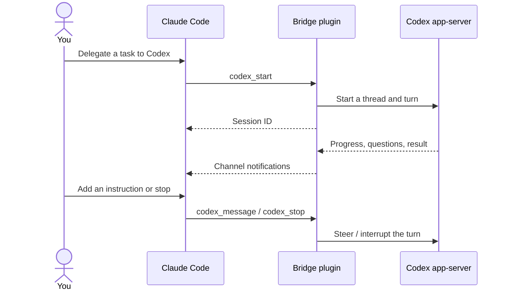

# Claude Codex Bridge

Run OpenAI Codex agents from Claude Code. Ask Claude to delegate a task to
Codex, follow its progress, send another instruction while it works, stop it,
or continue a saved session.

The plugin connects Claude's MCP tools and Channels to `codex app-server`.
Codex tasks run asynchronously; starting a task returns its session ID without
waiting for the task to finish.



## Requirements

- **Claude Code 2.1.261**, installed and signed in.
- **Codex CLI 0.153.4**, installed and signed in with access to the model you
  want to use.
- **Bun 1.4.0**, available on the same machine.

These are the tested versions. Older versions are unsupported; compatibility
with newer versions must be verified. The plugin uses the experimental Codex
app-server protocol and Claude Code Channels research preview.

Both `bun` and `codex` must be on the `PATH` inherited by Claude Code. The ZIP
release includes the bridge's JavaScript dependencies, so installing the plugin
requires no source build, package installation, or protocol generation.

## Install

### 1. Check the required tools

Install [Claude Code](https://code.claude.com/docs/en/quickstart),
[Codex CLI](https://developers.openai.com/codex/cli/), and
[Bun](https://bun.sh/docs/installation), then check:

```sh
claude --version
codex --version
bun --version
codex login status
```

If Codex is not signed in, run `codex login`. Claude and Codex use their own
accounts and model access. The plugin does not provide a subscription or API
credits.

### 2. Add the marketplace and install the plugin

```sh
claude plugin marketplace add umum-ai/claude-codex-bridge
claude plugin install claude-codex-bridge@claude-codex-bridge --scope user
```

Claude downloads the versioned ZIP from this repository's
[Releases](https://github.com/umum-ai/claude-codex-bridge/releases) and checks
its SHA-256 against the marketplace entry.

### 3. Enable the plugin and Channels

Merge this into `~/.claude/settings.json`, keeping your other settings:

```json
{
  "channelsEnabled": true,
  "extraKnownMarketplaces": {
    "claude-codex-bridge": {
      "source": {
        "source": "github",
        "repo": "umum-ai/claude-codex-bridge"
      }
    }
  },
  "enabledPlugins": {
    "claude-codex-bridge@claude-codex-bridge": true
  }
}
```

The installation commands already register the marketplace and enable the
plugin. The complete fragment above also shows how to reproduce the settings.

### 4. Start Claude in your project

```sh
cd /absolute/path/to/your/project
claude
```

The maintainer reports that `channelsEnabled: true` enables this ordinary
startup on Claude Code 2.1.261 without a shell alias or wrapper. Channel
activation can also depend on your account and organization policy. Verify
incoming progress with the example below before relying on it.

Anthropic's [Channels documentation](https://code.claude.com/docs/en/channels#enterprise-controls)
currently describes `channelsEnabled` as a managed setting and requires
per-session opt-in. If tools load but incoming progress does not arrive, see
[Channels troubleshooting](#tools-work-but-live-progress-does-not-arrive).

## Use it

Talk to Claude normally. Give Codex a concrete task, the project directory, and
an explicit model when you want one:

> Use the bridge to start Codex with model gpt-5.6-luna in
> /absolute/path/to/my-project. Review the authentication code and suggest a
> fix for the failing login test. Report its progress as channel events arrive.

To check that notifications work, use a task with a short delay:

> Start Codex in this project. Ask it to announce that it started, run a command
> that waits 15 seconds, and then reply BRIDGE_DONE. Wait for channel events;
> do not poll codex_status or codex_events.

While Codex is working:

> Tell that Codex session to focus on the token refresh path.

To interrupt it:

> Ask that Codex session to stop.

After a task completes:

> Continue that Codex session: implement the proposed fix and run the relevant
> tests.

Keep the `threadId` if you want to continue after restarting Claude:

> Resume Codex thread THREAD_ID in /absolute/path/to/my-project, then ask it to
> continue the investigation.

Claude can list available models with `codex_models`. An explicitly selected
model is requested without provider fallback.

## Available tools

| Tool | What you can ask Claude to do |
| --- | --- |
| `codex_models` | List the models available to Codex. |
| `codex_start` | Start an independent task in an absolute project directory. |
| `codex_message` | Send an instruction during a turn, or start the next turn. |
| `codex_stop` | Interrupt the current turn. |
| `codex_resume` | Reopen a saved Codex thread. |
| `codex_answer` | Answer a structured question from Codex. |
| `codex_status` | Read status, pending questions, and the latest answer. |
| `codex_events` | Read recent events using a sequence cursor. |

## How it works

Claude starts the plugin as an MCP server. The plugin starts a local
`codex app-server` process and uses its stdio protocol to manage Codex sessions.
Control calls return promptly; the task continues inside Codex. This does not
use a long-running Claude Bash tool call, and task duration is independent of
Claude's Bash timeout. Control acknowledgements have a 30-second timeout.

Codex progress, questions, errors, and completion arrive through Claude
Channels. Claude processes queued notifications when it can take its next
turn. A successful notification write does not confirm that Claude has read it.
Codex sessions appear through tools and messages, not as native Claude agents
in its subagent panel.

**Codex runs with `danger-full-access` and `approvalPolicy: never`.** It can
modify files and run commands with the permissions of your local user without
requesting approval. Claude's tool permissions do not sandbox Codex. Choose the
project directory and tasks with that execution mode in mind.

The plugin uses Codex's existing authentication and configuration. It adds no
API proxy, model impersonation, interception hook, or global timeout override.
Exiting Claude stops the bridge and its app-server process. Saved Codex threads
can be resumed; running work is not hosted by a background daemon.

Progress is batched about once a second and capped at 8,000 characters per
batch. The bridge retains 200 recent events across sessions and up to 64,000
characters of the latest answer. Truncation and an expired event cursor are
reported explicitly. The event journal lives only for the current bridge
process.

## Update or uninstall

To install the latest published version:

```sh
claude plugin marketplace update claude-codex-bridge
claude plugin update claude-codex-bridge@claude-codex-bridge
```

Restart Claude after updating. To remove the plugin:

```sh
claude plugin uninstall claude-codex-bridge@claude-codex-bridge --scope user
claude plugin marketplace remove claude-codex-bridge
```

## Troubleshooting

### Tools work but live progress does not arrive

Tool availability and incoming channel delivery have separate gates. Use
`codex_status` to confirm the task is running and check Claude's startup notices
for a channel or organization-policy warning.

For testing this custom channel, start a session with:

```sh
claude --dangerously-load-development-channels plugin:claude-codex-bridge@claude-codex-bridge
```

This explicit preview flag is the integration-tested path for incoming events.
The plugin is not on Anthropic's official channel allowlist. An organization can
approve it in managed settings with `channelsEnabled: true` and an
`allowedChannelPlugins` entry naming marketplace `claude-codex-bridge` and
plugin `claude-codex-bridge`; an approved session uses
`--channels plugin:claude-codex-bridge@claude-codex-bridge`. Preserve any other
channels on the organization's allowlist.

### The MCP server fails to start

Check that `bun --version` and `codex --version` work in the same terminal where
you launch Claude. Restart Claude after installing either tool or changing
`PATH`. Use `/mcp` in Claude to inspect the server connection.

### Codex rejects the model or account

Run `codex login status` and ask Claude to call `codex_models`. Model access is
controlled by your Codex account. A requested model error is surfaced directly.

### A task disappeared after restarting Claude

Ask Claude to call `codex_resume` with the saved `threadId` and project directory.
The event journal does not survive a restart; the saved Codex conversation does.

Report reproducible problems at
[GitHub Issues](https://github.com/umum-ai/claude-codex-bridge/issues), including
the three tool versions, the failed operation, and relevant error messages.
Remove credentials and private project content from reports.
